# Integrate an Investment Portfolio

> Data Science Experience is now Watson Studio. Although some images in this code pattern may show the service as Data Science Experience, the steps and processes will still work.

In this code pattern, we will integrate a user's brokerage portfolio (e.g. eTrade, charles schwab, Fidelity) with IBM's Investment Portfolio service.  The integration will use Quovo's Aggregation API to aggregate user's portfolio account and post it to the Investment Portfolio service. The steps to perform the integration will be done using Jupyter Notebook with Python scripts. The IBM Watson Studio provides a great place to work with notebooks, in addition to other data analytical tools and services. In this code pattern, we will use IBM Watson Studio for walking through steps in our notebook.  In addition, the steps have been put together to create a web application that performs the integration of user's brokerage portfolio data with Investment Portfolio service.  This pattern is targeted at an intermediate developer.

When the reader has completed this code pattern, they will understand how to:

* Retrieve portfolio information and positions from a brokerage account using Quovo
* Load Investment Portfolio service with portfolio and holdings
* Use IBM Watson Studio to open and run cells in notebook

# Architecture Flow

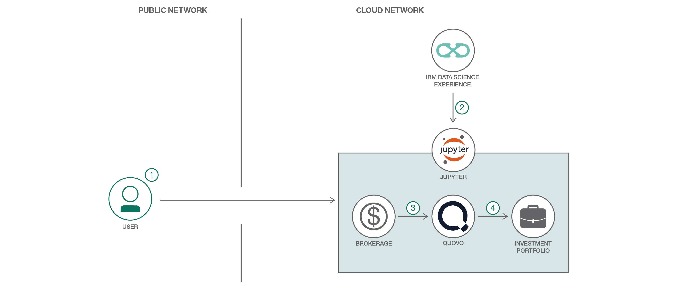

1. The user logs into IBM Watson Studio
2. The user creates a project and opens the notebook
3. The initial steps walk through retrieving brokerage portfolio account info using Quovo Aggregation API
4. The next steps loads the portfolio and associated holdings into the Investment Portfolio service

## Included Components
+ [Investment Portfolio](https://console.bluemix.net/apidocs/751-investment-portfolio)
+ [Quovo's Aggregation API service](https://api.quovo.com/docs/agg/)
+ [IBM Watson Studio](https://dataplatform.ibm.com)

**Note:** these services are free for those who have a Lite account

## Featured technologies
+ [Jupyter Notebook](http://jupyter.org/)
+ [Python](https://www.python.org/downloads/)

# Running the Application
Follow these steps to setup and run this code pattern. The steps are described in detail below.

## Steps
1. [Create Quovo account](#1-create-quovo-account)
2. [Create Investment Portfolio service](#2-create-investment-portfolio-service)
3. [Sign up for the Watson Studio](#3-sign-up-for-the-data-science-experience)
4. [Open the SetupPortfolio Notebook](#4-open-the-setupportfolio-notebook)
5. [Add Credentials](#5-add-credentials)
6. [Walk through steps to integrate portfolio with Investment Portfolio](#6-walk-through-steps-to-integrate-portfolio-with-investment-portfolio)
7. [Explore the App](#6-explore-the-app)

## 1. Create Quovo account

Create a [Quovo account](https://www.quovo.com/pricing/).  A Sandbox account can be used to integrate the portfolio for this example.

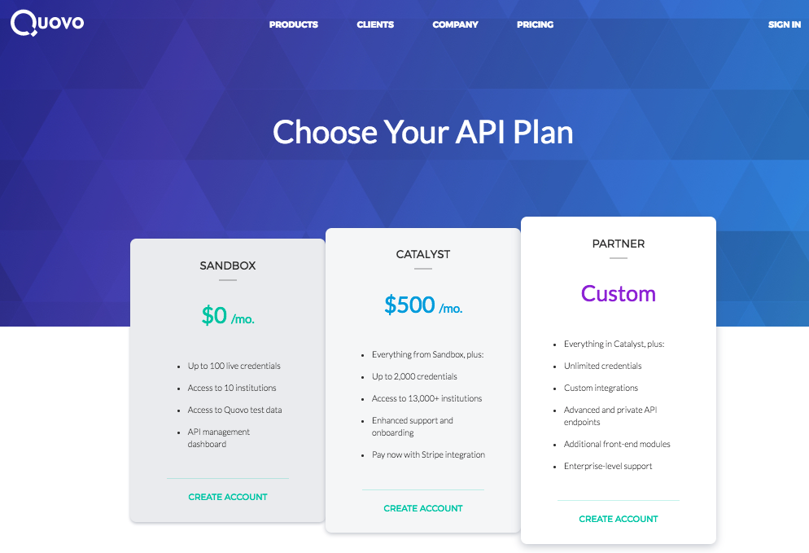

## 2. Create Investment Portfolio service

Create the following service:

* [**Investment Portfolio**](https://console.ng.bluemix.net/catalog/services/investment-portfolio)

1. Go to [IBM Cloud](https://www.ibm.com/cloud/). Login or sign up if you don't have an account
2. Select Catalog (on upper right-hand navigation)
   
3. Select All Categories
   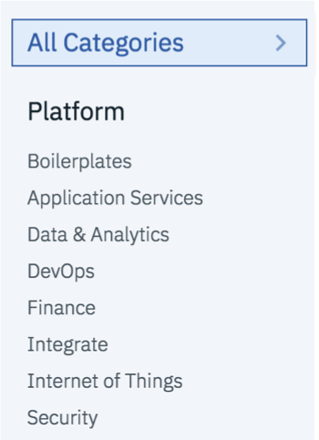
4. Scroll to the bottom of the screen and click on Experimental Services
   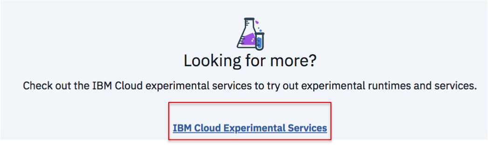
5. Scroll down to the `Finance` section and select the service: Investment Portfolio
   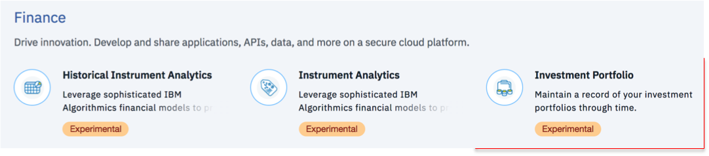
6. Select `Create` (lower right hand side)
   


## 3. Sign up for the Watson Studio

Sign up for IBM's [Watson Studio](https://dataplatform.ibm.com). By creating a project in Watson Studio a free tier ``Object Storage`` service will be created in your IBM Cloud account. Take note of your service names as you will need to select them in the following steps.

> Note: When creating your Object Storage service, select the ``Free`` storage type in order to avoid having to pay an upgrade fee.

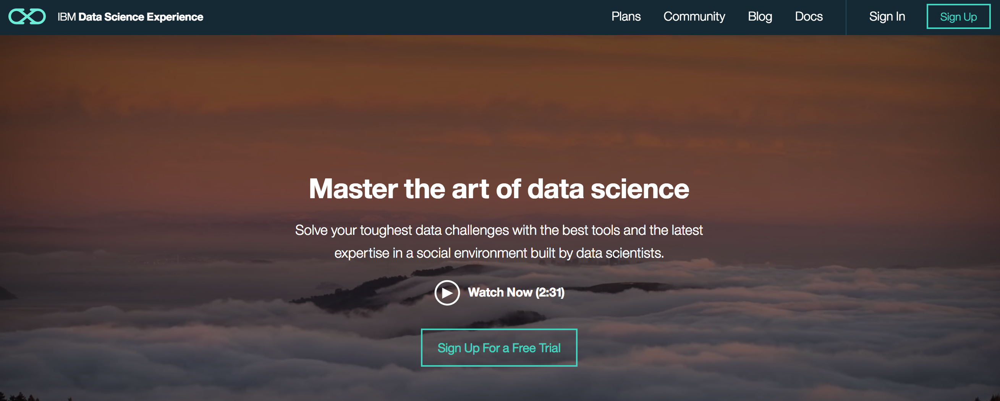

## 4. Open the SetupPortfolio Notebook

Once you have completed the steps outlined above, you are ready to open and walk through the Notebook.  Go ahead and sign into Watson Studio and create a Project

__Create a Project:__
* Click on ``Get Started`` in the top right corner, and then ``New Project``.

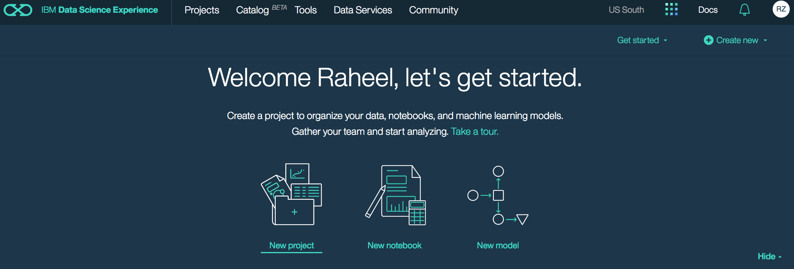

* In the 'Create new project' window, enter a ``Name`` and, optionally, a ``Description``. 

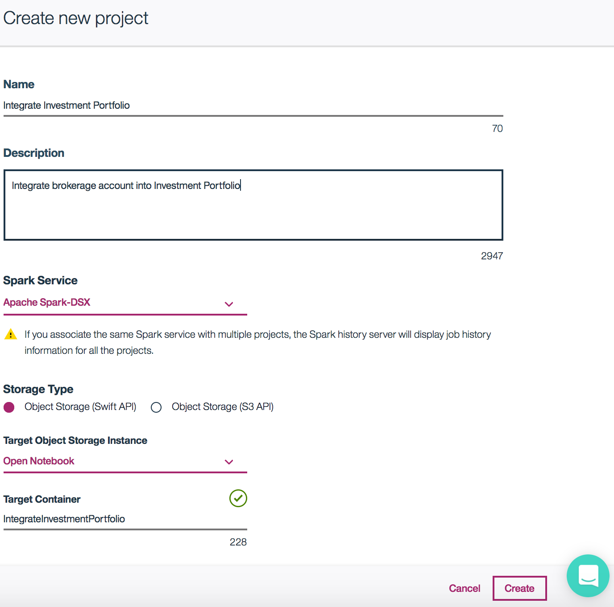

* Click ``Create``.

__Create Notebook:__
* After your project opens, click ``add notebooks``.

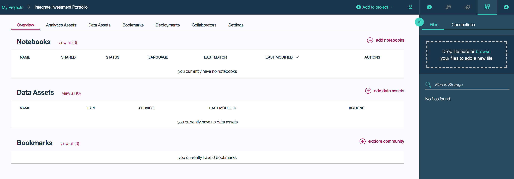

* With IBM Watson Studio, you can start with a ``Blank`` notebook or open ``From File``. We will import the notebook from Github, so will use ``From URL``.  Click the tab for ``From URL``. Enter a ``Name`` and an optional ``Description``.

* In the ``Notebook URL`` box put:

```
https://github.com/IBM/Integrate-Investment-Portfolio/blob/master/notebooks/SetupPortfolio.ipynb
```

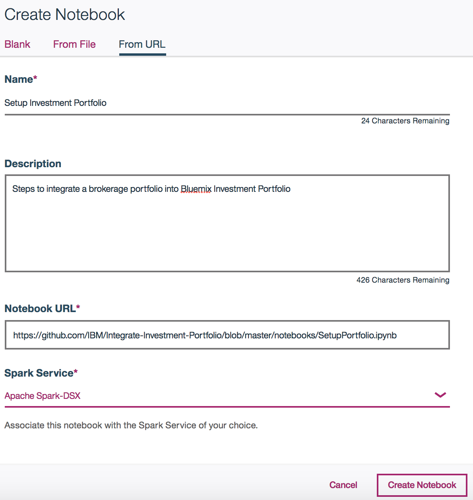

* Click ``Create Notebook``. This should open the notebook in your IBM Watson Studio.

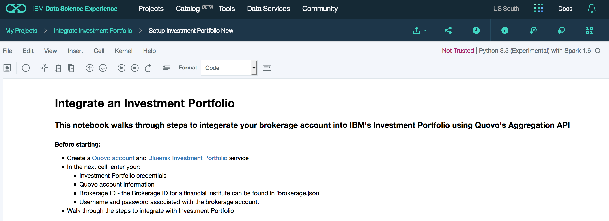

## 5. Add Credentials

Once the notebook opens, you will need to add: credentials for the Investment Portfolio service, your Quovo login information and your brokerage info.  

In the `Enter Credentials` cell, enter your:
  * Quovo account information
  * Brokerage ID - the Brokerage ID for a financial institute can be found in 'brokerage.json'
  * Username and password associated with the brokerage account
  * Investment Portfolio credentials

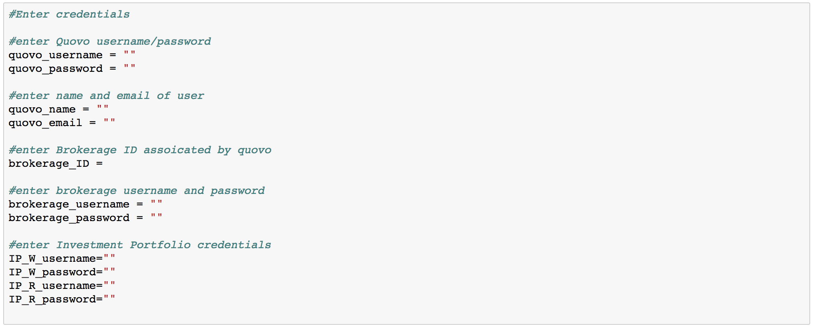

Once your credentials are entered, go ahead and run the cell.

## 6. Walk through steps to integrate portfolio with Investment Portfolio

You are now ready to integrate your portfolio data with Investment Portfolio. Each step provides a description of the step and what actions the script will perform. Walk through steps by running each cell in order, as the script may be dependent on information retrieved in the previous step.

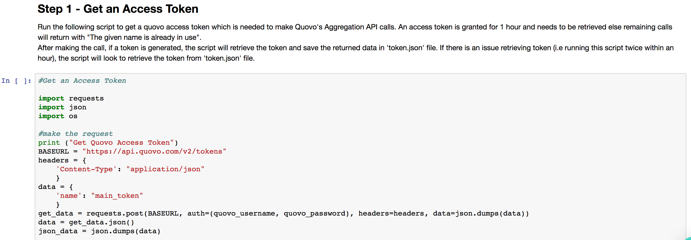

The initial steps use Quovo's Aggregation API to retrieve portfolio data from your brokerage account. Once the portfolio and its associated positions are retrieved, we load the portfolio data and associated positions as holdings into Investment Portfolio.

## 7. Explore the App

You can run a web application using the steps from the notebook to capture portfolio data from user's brokerage account into Investment Portfolio service by deploying directly to IBM Cloud or run it locally.

### Deploy to IBM Cloud

Deploy the web application. This will create an Investment Portfolio service for you.

[](https://bluemix.net/deploy?repository=https://github.com/IBM/Integrate-Investment-Portfolio)

### Run it locally

#### Clone the repo

Clone the Integrate-Investment-Portfolio code locally. In a terminal, run:

```
git clone https://github.com/IBM/Integrate-Investment-Portfolio.git
```

#### Configure .env file

You can run it locally by providing your Investment Portfolio credentials in a `.env file`. Copy the sample `.env.example` file using the following command:

```
cp .env.example .env
```

and fill in your Investment Portfolio credentials.

```
#INVESTMENT PORTFOLIO

CRED_PORTFOLIO_USERID_W=
CRED_PORTFOLIO_PWD_W=
CRED_PORTFOLIO_USERID_R=
CRED_PORTFOLIO_PWD_R=
URL_GET_PORTFOLIO_HOLDINGS=https://investment-portfolio.mybluemix.net/api/v1/portfolios/
```

#### Run application

In your project directory:

+ Run `pip install -r requirements.txt` to install the app's dependencies
+ Run `python run.py`
+ Access the running app in a browser at <http://0.0.0.0:8080/>

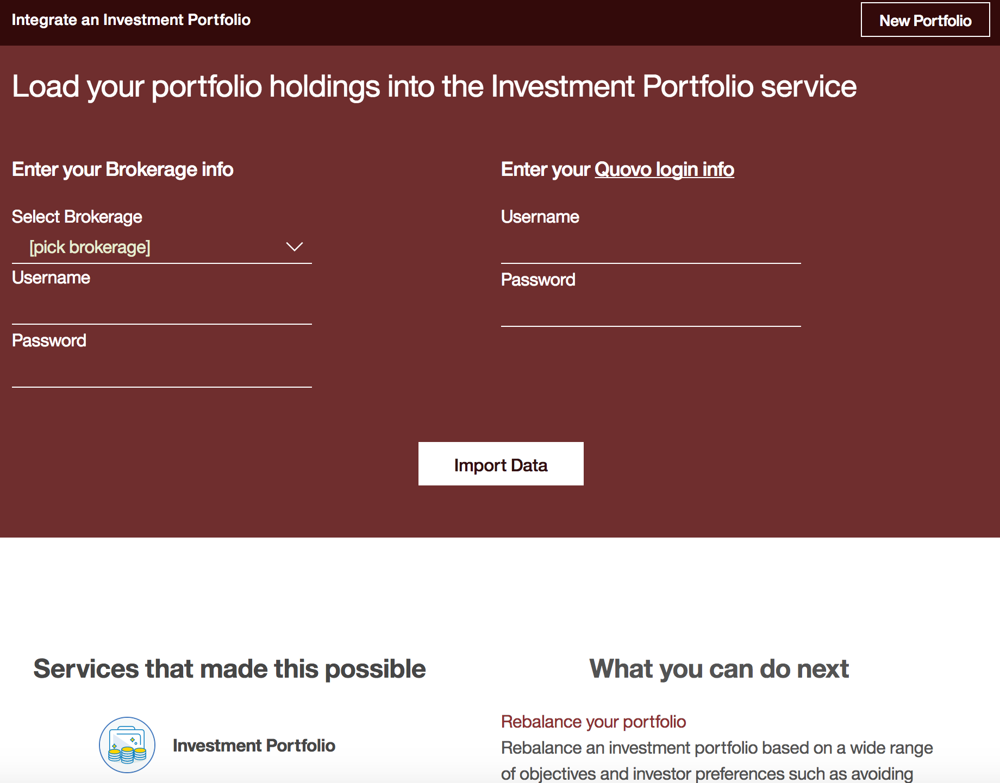

Go ahead and integrate your portfolio with IBM's Investment Portfolio!


# License

This code pattern is licensed under the Apache Software License, Version 2.  Separate third party code objects invoked within this code pattern are licensed by their respective providers pursuant to their own separate licenses. Contributions are subject to the Developer [Certificate of Origin, Version 1.1 (DCO)] (https://developercertificate.org/) and the [Apache Software License, Version 2] (http://www.apache.org/licenses/LICENSE-2.0.txt).

ASL FAQ link: http://www.apache.org/foundation/license-faq.html#WhatDoesItMEAN